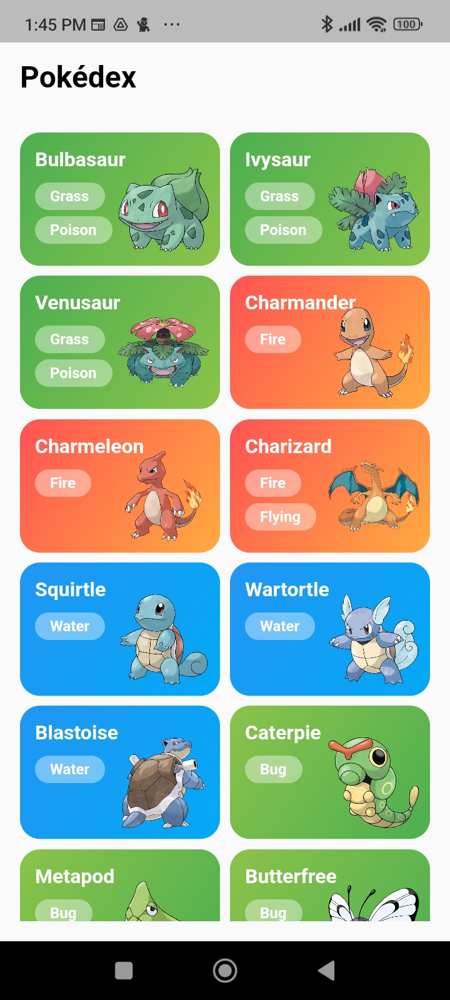
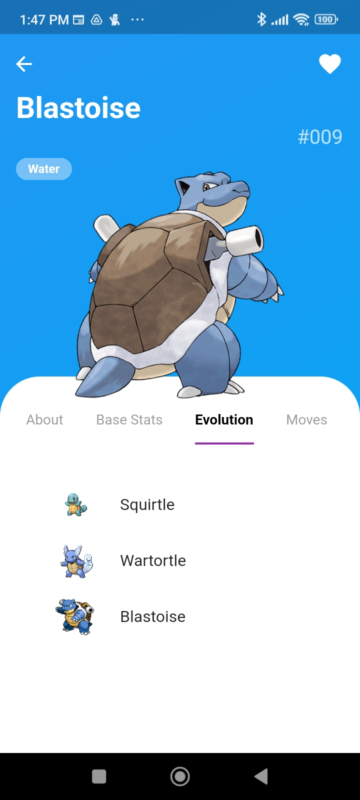
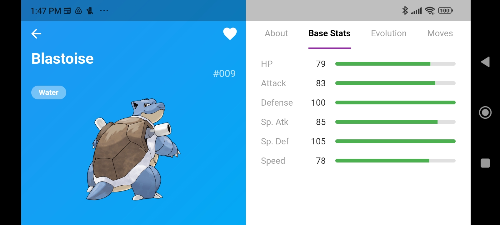

# pokemon_app

A new Flutter project.

## Getting Started

This project is a starting point for a Flutter application.

dependencies: - provider - shared_preferences

features: - Portrait & Landscape mode - Favorite Pokemon features - Tab Features

- List View Screenshots
  

- Detail Portrait mode Screenshots
  

- Detail Landscape mode Screenshots
  
